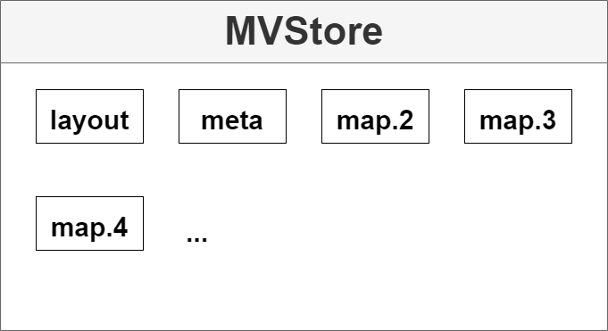
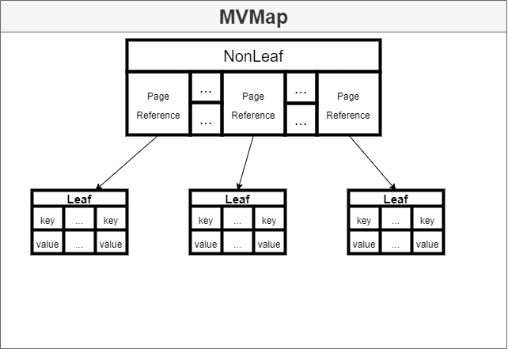
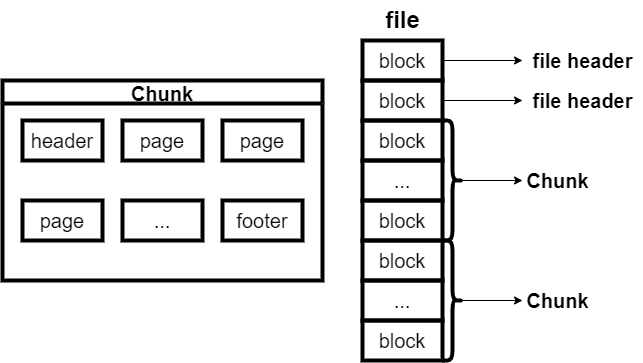

# <center>源码分析报告三——MVStore综合报告</center>
## 1. 前言
&ensp;&ensp;&ensp;&ensp;本篇报告将以往两次报告进行整理，并且添加了MVStore涉及到的两个设计模式介绍。
## 2. 项目介绍
### 2.1 关于H2 Database
&ensp;&ensp;&ensp;&ensp;H2 Database（以下简称H2）是由Java编写的、开源的轻量级嵌入式数据库。它可以容易地嵌入到项目中，以及配置成内存数据库运行。<br>
&ensp;&ensp;&ensp;&ensp;项目地址：https://github.com/h2database/h2database
### 2.2 H2部分功能及特性
- 平台无关性：H2完全采用Java编写。而由于Java语言的特性——即Java语言创建的可执行二进制程序能够直接运行于多个平台，H2运行可以不受平台限制。
- 嵌入式：这是H2最常用的功能。H2可以很方便地嵌入到其它项目中（导入依赖即可），方便地存储少量结构化数据（例如姓名、日期、地址等这些高度组织和整齐格式化的数据）。
- 内存数据库：H2支持在内存中创建数据库和表。众所周知，内存读写速度要比磁盘多许多倍。这是内存数据库的一大优势。不过当进程结束时，这些数据会丢失。但H2可以将数据持久化，将其保存在磁盘中。——这可以根据使用者的需求，选择数据去留。
- 支持全文检索：H2内置了全文搜索和基于Apache Lucene的全文检索。
- 适用于单元测试：基于H2轻量级、读写速度快、即用即消（通过搭建内存数据库）、嵌入式等特性，对于单元测试（检验程序模块，数据不需要保存）来说相当方便。
- 2种连接方式：嵌入式(本地)连接、使用TCP/IP服务器模式(远程连接)。
- 3种运行模式：嵌入式模式、服务器模式和混合模式。

&ensp;&ensp;&ensp;&ensp;以上仅列举了H2功能及特性的一小部分，限于篇幅不再过多展开。在这里笔者给出H2官网链接，供读者查阅：[H2 Database Engine](http://www.h2database.com/html/main.html)
### 2.3 MVStore简介
&emsp;&emsp;MVStore意思是“multi-version store”，即多版本存储。在H2较新版本作为默认存储引擎。之后我们将针对此模块进行探讨。

&emsp;&emsp;下面将以一个示例简要说明MVStore的功能。（源自官方文档，有些许修改）
```Java
import org.h2.mvstore.*;

public static void main(String[] args) throws Exception {
    // open the store (in-memory if fileName is null)
    MVStore s = MVStore.open("E:/Java/H2Test");

    // create/get the map named "data"
    MVMap<Integer, String> map = s.openMap("data");

    // add and read some data
    map.put(1, "Hello World!");
    map.put(3, "Hello Java!");
    System.out.println(map.get(1));
    System.out.println(map.get(3));

    // close the store (this will persist changes)
    s.close();
}
```
&ensp;&ensp;&ensp;&ensp;一开始，我们建立了一个MVStore类的对象`s`——实际上在路径`E:/Java`下，我们尝试打开名叫`H2Test`的文件，将其读入到内存中（如果没有则新建一个`H2Test`文件）。接着我们创建了一个名叫`data`的MVMap对象，存放在`s`中。MVMap是MVStore中特有的键值映射表，在映射表内我们可以再插入一些键值映射，写和读的方法和HashMap类似。最终的打印结果也很显然：
```
Hello World!
Hello Java!
```
&emsp;&emsp;虽然MVStore是H2的一个模块，但正如上面的例子所示，其也可以在不涉及JDBC和SQL的应用中使用。

## 3. 功能流程分析
&emsp;&emsp;以下将以用户基本操作和数据结构两个方面介绍MVStore的功能及其实现。
### 3.1 用户基本操作
#### 3.1.1 新建MVStore类、MVMap类对象
&emsp;&emsp;MVStore存储模块以MVStore类为核心，用户创建MVStore类对象，相当于创建了一个小型数据库，后续的一系列操作都围绕在这个创建的对象进行。创建一个MVStore类对象有两种方式：
```Java
/* 方式一 */
MVStore s = MVStore.open("E:/Java/H2Test");
/* 方式二 */
MVStore s = new MVStore.Builder().
encryptionKey("007".toCharArray()).
compress().
open();
```
&emsp;&emsp;第一种方式调用`MVStore`中的`open`方法，按照参数中提供的路径打开对应文件，加载到MVStore类对象`s`中；第二种方式实际上是通过MVStore的对应建造者Builder来创建对象。这两种方法的区别在于，用户可以通过第二种方式调整对象的相关属性（比如此处可以设置密码`encrptionKey`和压缩策略`compress`），而第一种方式创建的所有属性都是默认的。两种方法对象的创建都是通过`open`方法实现的，这两种方法大同小异，具体分析详见[第4.1节](#41-建造者模式)。

&emsp;&emsp;MVMap是MVStore所存储的表项。一个MVStore可以存储多个MVMap。对用户而言，创建MVMap只需要一种方式：
```Java
MVStore s = MVStore.open(null);//内存模式
/*创建名为data的map*/
MVMap<Integer, String> map = s.openMap("data");
```

#### 3.1.2 MVMap操作
&emsp;&emsp;MVMap实现了ConcurrentMap接口，而ConcurrentMap接口继承Map抽象类。作为一个数据库，MVMap需要保证并发操作相关的问题。对于用户而言，对MVMap无非增删改查操作，而这些操作和普通的Map是一样的。此处便不多作赘述。

&emsp;&emsp;下面展示增删改查操作的实现方式：
```Java
/* get */
public final V get(Object key) {
    return get(getRootPage(), (K) key);
}

/* put */
public V put(K key, V value) {
    DataUtils.checkArgument(value != null, "The value may not be null");
    return operate(key, value, DecisionMaker.PUT);
}

/* remove */
public boolean remove(Object key, Object value) {
    EqualsDecisionMaker<V> decisionMaker = new EqualsDecisionMaker<>(valueType, (V)value);
    operate((K)key, null, decisionMaker);
    return decisionMaker.getDecision() != Decision.ABORT;
}    
```
&emsp;&emsp;从源码中我们可以看到`V get(Object key)`方法实际上调用了`V get(Page<K,V>, K key)`方法，这一部分内容将在3.2节中分析。而`V put(K key, V value)`和`boolean remove(Object key, Object value)`方法则都调用了`V operate(K key, V value, DecisionMaker<? super V> decisionMaker)`方法，这一部分内容将在[4.2节](#42-命令模式)中分析。
#### 3.1.3 提交和关闭
&emsp;&emsp;MVStore提交和关闭对应的方法为`long commit()`和`void close()`。由于这两个方法的链路相当长，而且与核心功能流程关系不大，因此不多作展开。值得一提的是，`long commit()`方法的返回值为保存后的版本（version）号，版本相关内容将在[下一小节](#314-多版本存储)中讲述。

&emsp;&emsp;另外，通过阅读`long commit()`代码发现，此处包含锁相关的操作，这一点很容易理解：H2数据库需要考虑多用户访问和写入的操作。
```Java
public long commit() {
    return commit(x -> true);
}

private long commit(Predicate<MVStore> check) {
    if(canStartStoreOperation()) {
        storeLock.lock();
        try {
            if (check.test(this)) {
                return store(true);
            }
        } finally {
            unlockAndCheckPanicCondition();
        }
    }
    return INITIAL_VERSION;
}
```
#### 3.1.4 多版本存储
&emsp;&emsp;在之前的介绍中提到过，MVStore的本意就是多版本存储。何为多版本？简单地说：每一次提交都是一个新的版本。MVStore在持久化的时候，不会覆盖以前的版本，而是将老版本和新版本一起保留下来。这种机制类似于快照，其背后采用了写时复制技术。以下是多版本存储用法的一个示例：
```Java
// create/get the map named "data"
MVMap<Integer, String> map = s.openMap("data");

// add some data
map.put(1, "Hello");
map.put(2, "World");

// get the current version, for later use
long oldVersion = s.getCurrentVersion();

// from now on, the old version is read-only
s.commit();

// more changes, in the new version
// changes can be rolled back if required
// changes always go into "head" (the newest version)
map.put(1, "Hi");
map.remove(2);

// access the old data (before the commit)
MVMap<Integer, String> oldMap =
        map.openVersion(oldVersion);

// print the old version (can be done
// concurrently with further modifications)
// this will print "Hello" and "World":
System.out.println(oldMap.get(1));
System.out.println(oldMap.get(2));

// print the newest version ("Hi")
System.out.println(map.get(1));
```
### 3.2 数据结构
&emsp;&emsp;作为一个存储引擎，其核心应该是对数据的管理。因此，讨论其采用的数据结构是很有必要的。笔者将MVStore结构划为两个部分：内存模式的数据结构和文件模式的数据结构，两者既有区别，也有联系。
#### 3.2.1 内存模式下的数据结构
&emsp;&emsp;H2作为内存数据库，与本部分的内容是相当紧密的。此处我们将看到内存模式下，数据是如何放在内存中的。
#### 3.2.1.1 MVStore
&emsp;&emsp;在此前的介绍中我们知道，一个MVStore类对象中存储着多个MVMap表——这就类似于Excel可以存放多个工作表。MVStore实际上就是用户操作的平台：用户可以在这个平台上添加表项，并对表内的数据进行访问或修改。


<center>MVStore的成员变量（采用PlantUML绘制）</center>

&emsp;&emsp;在上面的图中，我们目前只需要关注两个成员变量：`MVMap<String, String> meta`和`ConcurrentHashMap<Integer,  MVMap<?, ?>> maps`。这两个变量记录了用户存储数据的相关信息，可以说是所存储的所有MVMap相关的元数据。我们首先要知道的是，MVStore给每一个MVMap都分配了一个id。每一个MVMap的id都是独有的。通常来说，`meta`的id是1。我们通过下图来看这两个成员变量存储了什么信息：
<div align = center>

</div>
<center>meta和maps存储信息</center>

&emsp;&emsp;MVStore中事先存了两个MVMap：一个为“data”，一个为“oops”。从上图我们可以看到，`meta`存储的是`map.id -> map.name`和`map.name -> map.id`，而`maps`存储的则是`map.id -> map`。
#### 3.2.1.2 MVMap
&emsp;&emsp;接下来我们探讨MVMap的组成。在官方文档中我们得知，MVMap的结构是一个B+树。接下来我们来看MVMap的成员变量：

<center>MVMap的成员变量（采用PlantUML绘制）</center>

&emsp;&emsp;我们关注以下成员变量：`MVStore store`、`int id`、`DataType<K> keyType`、`DataType<V> valueType`、`int keysPerPage`和`AtomicReference<RootReference<K, V>> root`。

&emsp;&emsp;首先前面几个成员变量很好理解。`MVStore store`用来指示当前MVMap所属的MVStore，`int id`表示自身在所属MVStore的id号，`DataType<K> keyType`和`DataType<V> valueType`用来指示自身存储键值对的类型。而后面两个则有些难理解——但是我们知道MVMap是一个树形结构，而树有结点，因此`root`很容易猜到指的是根节点。从这里我们可以知道，MVMap实际上只存储了根节点，并没有存储整个树。

&emsp;&emsp;`keysPerPage`则需要引入MVMap树的结点。在B+树中，树的结点分为叶子结点和非叶子结点。结点在MVMap中称为“Page”——这个表达或许有些奇怪，实际上，这个名称来自于之后要提到的文件模式。

    需要注意的是，Page是连接内存模式和文件模式的桥梁。

&emsp;&emsp;Page的地位相当重要，我们有必要去了解。


<center>Page的成员变量（采用PlantUML绘制）</center>

&emsp;&emsp;前面我们说过，Page是连接内存模式和文件模式的桥梁，因此这里出现了一些文件模式下应该会有的东西，比如`long pos`（在文件中的位置）、`int diskSpaceUsed`等。此处我们关心它的两个子类：NonLeaf和Leaf。在父类中，我们看到一些熟悉的东西：比如`MVMap<K, V> map`、`K[] keys`，其意思分别是所属的MVMap以及键值。对于Leaf来说，它的拓展就很简单：只添加了`V[] values`，因为对于叶子结点来说，它的功能就是存储键值对；而NonLeaf则稍微多一点。此处我们注意到一个名叫“PageReference”的内部类，其意思便是B+树中的索引；NonLeaf只保存索引和键用于搜索，这些与B+树的定义是一致的。

&emsp;&emsp;由此`keysPerPage`的意思便清楚了：它实际上指的是结点中存储的最大键数量。在MVMap中，这个值默认为48。我们可以反推出MVMap的B+树默认是49阶的。这一点容易理解，B+树的阶需要大一些保证树的高度很小（一般不超过3），提升查找效率。

&emsp;&emsp;此外，MVStore的Map还有R树的实现：`MVRTreeMap`。而这种数据结构并不常用，这里不展开阐述。在[下一小节](#322-文件模式的数据结构)中，我们就会看到Page在文件模式下是怎么保存数据的。
#### 3.2.2 文件模式下的数据结构
&emsp;&emsp;文件模式就是将内存中的数据持久化到硬盘，以及硬盘中的数据读入到内存中。本部分将阐述文件模式下，数据是如何组成的。
#### 3.2.2.1 block和Chunk
&emsp;&emsp;首先来看存储文件的基本格式：
```
[ file header 1 ] [ file header 2 ] [ chunk ] [ chunk ] ... [ chunk ]
```
&emsp;&emsp;比较奇特的是，文件模式下的存储文件有两个文件头。官方文档这样解释：文件头更新的时候写操作可能会失败，从而损坏一个文件头，因此用两个文件头以作备用。

&emsp;&emsp;首先来了解一下`block`。`block`并不是某一具体的对象或类。实际上，`block`只是对存储空间的一个划分：我们将存储文件划分成整数个块，每一块我们就可以称之为`block`。`block`的大小在文件头中有定义。

&emsp;&emsp;关于文件头，以下是一个文件头的描述：
```
H:2,block:2,blockSize:1000,chunk:1,clean:1,created:184a7c079cd,format:2,version:1,fletcher:8e4ba0e2                                  
```

&emsp;&emsp;简单分析以下这些字段的意思：

- H：值固定为2，代表H2。
- block：最新block的起始数。（chunk会更新，后面将会介绍）
- blockSize：block的大小（用16进制表示——实际上这里所有的数均为16进制，单位为byte)
- chunk：chunk的id号（通常与version一致）
- clean：这个字段取决于上一次使用数据库是否完全关闭。如果上次使用未完全关闭（此时没有该字段），则尝试恢复。
- format：文件格式号。
- version：最新版本号。
- fletcher：弗莱彻校验和。

&emsp;&emsp;同时，文件头自身也占一个block。这一点很容易验证：
<div align = center>

</div>
<center>第一个文件头，首地址0x0000</center>
<div align = center>

</div>
<center>第二个文件头，首地址0x1000</center>
&emsp;&emsp;文件头用来描述文件的重要属性，Chunk用来存储数据内容。Chunk的成员变量如下所示：

<div align = center>

</div>
<center>Chunk的成员变量（PlantUML绘制）</center>

&emsp;&emsp;注意到这里的Chunk为抽象类，它有两个继承类：`SFChunk`和`MFChunk`，分别代表单文件（SingleFile）和多文件（MultiFile）的Chunk。在这里我们只讨论单文件存储（这也是MVStore的默认持久化方式）的情形。

&emsp;&emsp;直接看Chunk的成员变量有点抽象，官方文档给出了Chunk在文件中的格式：
```
[ header ] [ page ] [ page ] ... [ page ] [ footer ]
```

&emsp;&emsp; 我们可以看到，Chunk含有header和footer。header的作用依旧是给出本Chunk的重要属性，footer则主要用于校验。以下给出一个header和footer的例子：
```
chunk:1,len:1,pages:6,max:420,map:3,root:4000010446,time:18,version:1,next:3,toc:45b 
chunk:1,len:1,version:1,fletcher:90d3728c 
```
&emsp;&emsp;在这里，我们又一次见到了Page。在header中，我们可以看到这个Chunk有6个Page，换言之，有6个结点（可能来自不同的MVMap）。而`root`指的是`meta`（在内存模式提到过）的根节点位置。

&emsp;&emsp;从这里可以看到，Page实际上是在文件模式下的对数据的最小划分，并且在内存模式下读入，Page的上层结构（MVMap和Chunk）都不会出现在对方模式中，所以Page是沟通内存模式和文件模式的桥梁。

#### 3.3 MVStore结构和时序图
&emsp;&emsp;本部分将此章内容做一点总结，以图表的形式展示出来。
#### 3.3.1 内存模式数据结构图
<div align = center>

</div>
<center>MVStore结构图</center> 

&emsp;&emsp;注：此处`layout`只在文件模式下产生，其id号为0，用于记录文件所有chunk的信息以及当前`meta`的id和根结点位置。

<div align = center>

</div>
<center>MVMap结构图</center>

#### 3.3.2 文件模式数据结构图

<div align = center>

</div>
<center>存储文件结构图</center>

#### 3.3.3 时序图

&emsp;&emsp;最后以一个简单例子为例，展示MVStore工作的时序图。
```Java
public static void main(String[] args) throws Exception {
    MVStore s = MVStore.open("E:/Java/H2Test.mv.db");
    MVMap<Integer, String> map_1 = s.openMap("map_1");
    map_1.put(2,"Winter");
    map_1.put(3,"Summer");
    map_1.put(3,"Autumn");
    map_1.remove(3);
    System.out.println(map_1.get(2));
    s.commit();
    s.close();
}
```
时序图如下所示：（忽略了许多类和操作方法，仅展示重要部分）
<div align = center>

</div>
<center>MVStore示例时序图</center>

## 4. 设计模式
&emsp;&emsp;本部分笔者将介绍MVStore涉及到的两个设计模式——建造者模式和命令模式。需要注意的是，MVStore中设计模式的实现和标准做法并不一致，笔者仅介绍这些设计模式在MVStore中的实现。
### 4.1 建造者模式
&emsp;&emsp;在之前的介绍中，我们提到MVStore类中有一个Builder成员变量（实际上MVMap也有，但没有MVStore这样典型），此处便采用了建造者模式。

&emsp;&emsp;首先我们来考虑一下采用此模式的背景：MVStore的构建有相当多的参数，这些参数有些是可选的。

&emsp;&emsp;很容易想到的一种方案是采用构造方法，但此处行不通——因为我们需要为用户准备相当多的构造方法，并且用户还需要知道每个构造方法的参数代表哪个成员变量。
```Java
public class Item{
    /* 10个成员变量 */
    private String attribute_1;
    private String attribute_2;
    ...
    private String attribute_10;

    /* 相当多的构造方法 */
    public Item(String attribute_1){
        ...
    }

    public Item(String attribute_2){
        ...
    }

    public Item(String attribute_1, String attribute_2){
        ...
    }

    ...
    
}
```
&emsp;&emsp;另外一种方案是采用JavaBeans模式给用户setter方法，这一种要比前者要好，但是用户使用起来也比较麻烦——设置的参数较多时，代码会比较长，而且构造过程分解到多个调用中，JavaBeans可能处于不一致的状态。
```Java
public class Item{
    /* 10个成员变量 */
    private String attribute_1;
    private String attribute_2;
    ...
    private String attribute_10;

    /* 用户设置的参数较多时，代码会很长，并且可能会出错 */
    public setAttribute_1(String attribute_1){
        this.attribute_1 = attribute_1;
    }

    public setAttribute_2(String attribute_2){
        this.attribute_2 = attribute_2;        
    }
    ...
}
```
&emsp;&emsp;那有没有一种方案能够一步到位？这便用到了建造者模式。
展示一下之前出现过的代码，感受一下这个模式的魅力：
```Java
MVStore s = new MVStore.Builder().
encryptionKey("007".toCharArray()).
compress().
open();
```
&emsp;&emsp;使用Builder方法接着我们讨论它是如何实现的。Builder是MVStore的一个静态内部类，让我们看一下它的部分代码：
```Java
public static final class Builder {

    private final HashMap<String, Object> config;

    private Builder(HashMap<String, Object> config) {
        this.config = config;
    }

    public Builder() {
        config = new HashMap<>();
    }

    private Builder set(String key, Object value) {
        config.put(key, value);
        return this;
    }

    public Builder autoCommitDisabled() {
        return set("autoCommitDelay", 0);
    }

    ...

    public MVStore open() {
        return new MVStore(config);
    }
}
```
&emsp;&emsp;从这里我们可以看到，MVStore的Builder维护了一个名叫`config`的HashMap，实际上就是用户通过Builder将参数信息填入到`config`中，最后用Builder的`MVStore open()`方法调用MVStore的含参构造方法，遍历并解析`config`的每个键值对，从而完成实例化。
### 4.2 命令模式
&emsp;&emsp;在前面的介绍中我们得知，针对MVMap的删除和增改操作都由`V operate(K key, V value, DecisionMaker<? super V> decisionMaker)`方法完成。该方法中的参数有一个类叫做“DecisionMaker”，这个类是专门为`operate`设计的。
&emsp;&emsp;为什么要用到命令模式呢？命令模式的作用是将行为请求和行为实现解耦。在此处实际上这个作用并不明显：对用户来说，作为一个请求发起者，也就只有增删改操作，直接请求和执行一起完成似乎更省事。然而对MVMap进行请求操作的不止用户一个，除了用户可访问的MVMap外，其它模块也会建立一些MVMap，但它们更新数据的方法也与用户大不相同，有一些甚至还有撤回之类的操作——如果请求和执行绑定在一起，则会出现问题。为此MVStore采取的策略是：将各模块请求送给`DecisionMaker`处理，`DecisionMaker`将处理后的操作送给`operate`执行。

&emsp;&emsp;原本的DecisionMaker为抽象类，其有十多个继承。我们简单地将父类提取出一部分介绍一下。
```Java
public enum Decision { ABORT, REMOVE, PUT, REPEAT }
...
public abstract static class DecisionMaker<V> {
    public static final DecisionMaker<Object> DEFAULT = new DecisionMaker<Object>() {
        @Override
        public Decision decide(Object existingValue, Object providedValue) {
            return providedValue == null ? Decision.REMOVE : Decision.PUT;
        }

        @Override
        public String toString() {
            return "default";
        }
    };
    public static final DecisionMaker<Object> PUT = new DecisionMaker<Object>() {
        @Override
        public Decision decide(Object existingValue, Object providedValue) {
            return Decision.PUT;
        }
        @Override
        public String toString() {
            return "put";
        }
    }; 
    ...
    public Decision decide(V existingValue, V providedValue, CursorPos<?, ?> tip) {
        return decide(existingValue, providedValue);
    }
    public abstract Decision decide(V existingValue, V providedValue);
    public V operate(K key, V value, DecisionMaker<? super V> decisionMaker) {
        ...
        while(true) {
            ...
            CursorPos<K,V> tip;
            V result;
            ...
            try {
                ...
                Page<K,V> p = pos.page;
                int index = pos.index;
                tip = pos;
                pos = pos.parent;
                result = index < 0 ? null : p.getValue(index);
                Decision decision = decisionMaker.decide(result, value, tip);

                switch (decision) {
                    case REPEAT:
                        ...
                    case ABORT:
                        ...
                    case REMOVE:
                        ...
                    case PUT: 
                        ...
                }
                ...
            }
        }
    }
    ...         
}
```

&emsp;&emsp;从父类所示的代码来看，`DecisionMaker`默认划分成DEFAULT、PUT、REMOVE等策略，实际上这就是将请求参数化，将所有的请求划分成这几个部分（子类的会更复杂一些），`operate`在执行的时候，会调用`DecisionMaker`的`decide`方法，实际上`operate`最终区分不同执行方式，就是按照不同请求的`DecisionMaker`中`decide`的最终返回值`decision`。

&emsp;&emsp;因此不同地方发来的请求，首先向`DecisionMaker`说明是哪个请求，`DecisionMaker`再调用内部的`decide`方法决定`operate`如何执行，决定的请求以`decision`的形式发送，`operate`通过`decision`来判断执行策略。以此来实现请求与执行解耦。

### 4.3 总结
&emsp;&emsp;笔者认为，在实际应用过程中，应用场景是千变万化的，所谓的“标准”设计模式模板有时候也可能不是最优解。一个设计模式也可以衍生出许多变种，追求高效的同时也尽力将系统的复杂程度最小化。这相当考验开发者的智慧。